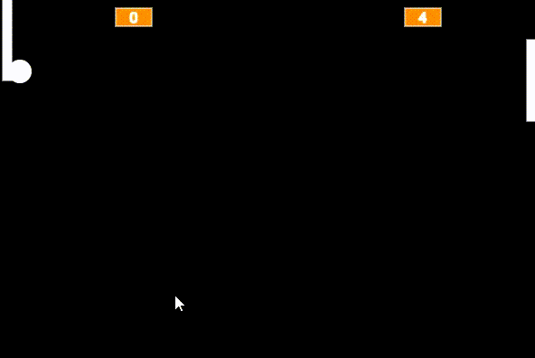

# PONG

É um jogo que tem a finalidade de acertar a parede do adversário com a bolinha e evitar que a bolinha encoste na sua parede, para isso usamos a raquete para bloquear a bolinha.

### Como jogar:

Utilize as setas UP e DOWN do seu teclado para movimentar a raquete.

